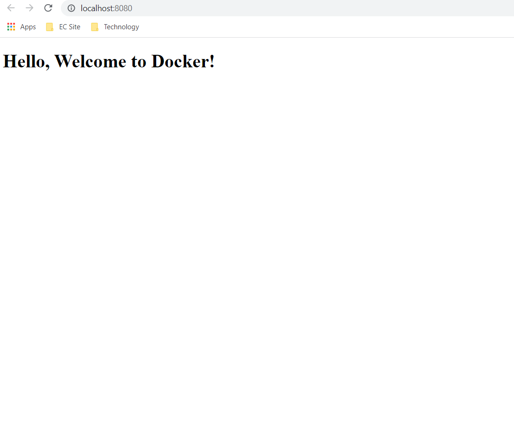

### Run the Apache web server on Ubuntu using docker without Dockerfile

1) Build ubuntu image

   ```docker pull ubuntu```

2) Run Docker Image

    ```docker run -it ubuntu```

3) Installing Apache

    ```apt update```
    ```apt install apache2```

### Run Apache web server with Dockerfile

1) Make Dockerfile and run image
   
    ```docker build -t apacheImage .```

2) Build Apache Container

     ```docker run -it -p 8080:80 apacheImage```

### Run Apache webserver using docker-compose.yml

- Make docker-compose.yml in your project folder and run this command
   
    ```docker-compose up -d --build```

- You run the project in browser
  
    